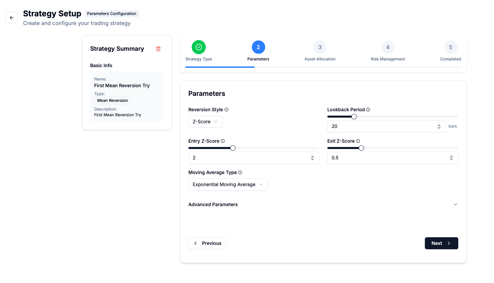
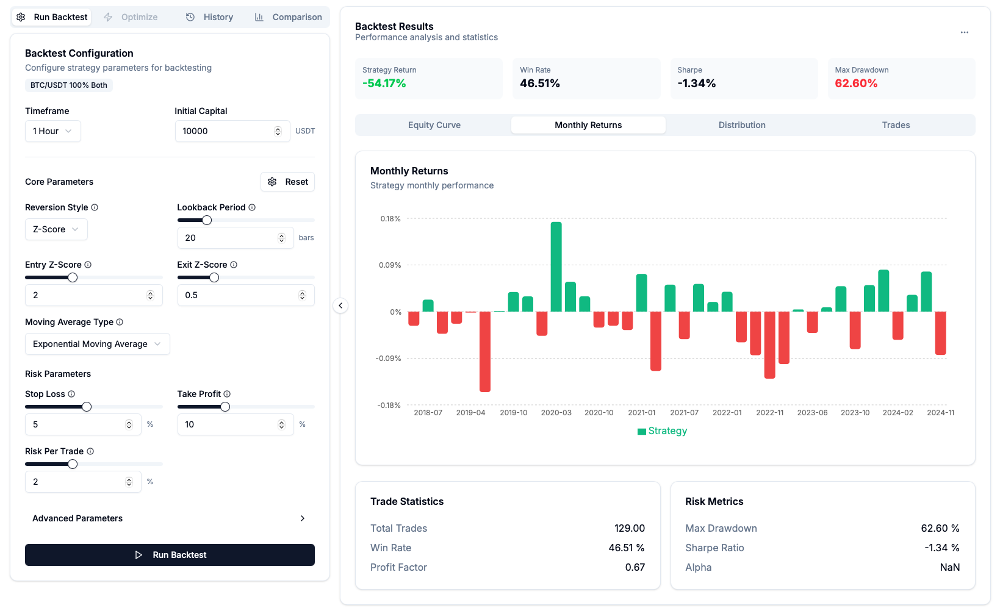
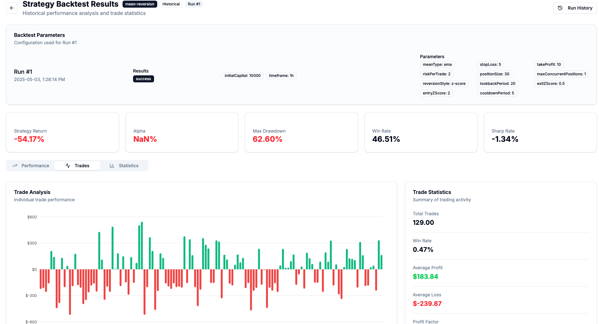
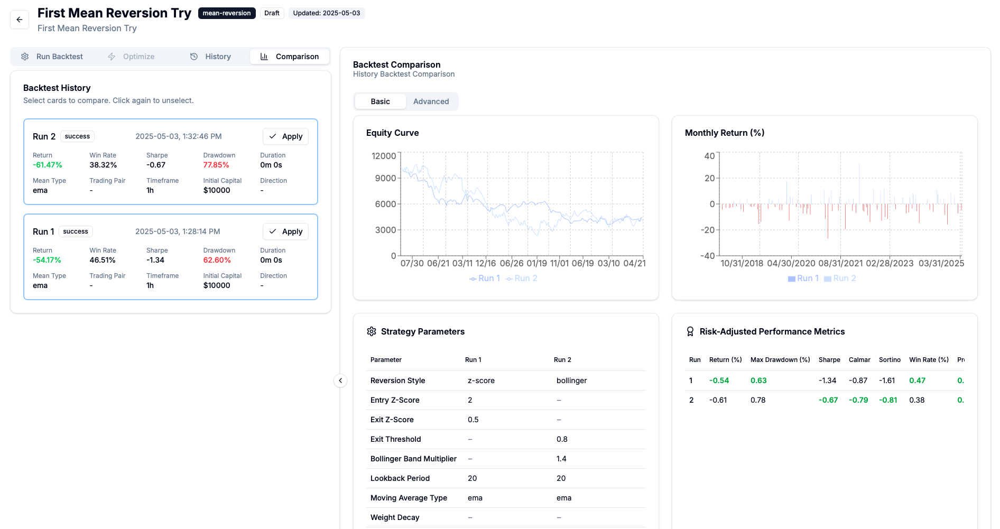

# QuantEdge UI 
> 🔗 **Live Demo**: [https://quantedge-iota.vercel.app](https://quantedge-iota.vercel.app)

🎛️ **QuantEdge UI** is a frontend dashboard for building, configuring, and analyzing quantitative cryptocurrency trading strategies.

This is the visual interface of the [QuantEdge Platform](https://github.com/8lovelife/quantedge_x), enabling users to construct trading strategies, run backtests, and evaluate performance — all through an intuitive web-based interface.

---

## ✨ Features

- **Interactive Strategy Builder**  
  Guide users through a multi-step wizard to define strategy type, parameters, asset allocation, and risk management.

- **Dynamic Form Rendering**  
  Automatically renders configuration fields based on backend-defined schemas, allowing flexible support for any strategy type.

- **Multi-Asset Portfolio Support**  
  Configure multiple assets per strategy, each with independent weight, exchange, direction, and parameters.

- **Backtest Result Dashboard**  
  Visualize backtest performance with equity curves, return metrics, position logs, and trade statistics via interactive charts.

- **Result Comparison View**  
  Compare performance across strategy runs side-by-side with metrics like Sharpe Ratio, Max Drawdown, and Profit Factor.  

- **Modern Component Design**  
  Built with [Shadcn/ui](https://ui.shadcn.com/) and [Tailwind CSS](https://tailwindcss.com/) for clean, modular, and responsive UI.

- **API-Ready Structure**  
  Designed for seamless connection to the [QuantEdge Engine](https://github.com/8lovelife/quantedge_x) backend via RESTful APIs.

---

## 🚀 Getting Started

### 1. Clone the Repository

```bash
git clone https://github.com/8lovelife/quantedge.git
cd quantedge
```

### 2. Install Dependencies

```bash
npm install
```

### 3. Start Development Server

```bash
npm run dev
```

Then open your browser at [http://localhost:3000](http://localhost:3000)

---

## 🧱 Tech Stack

- **Framework**: [Next.js](https://nextjs.org/) (App Router)
- **Styling**: [Tailwind CSS](https://tailwindcss.com/), [Shadcn/ui](https://ui.shadcn.com/)
- **Visualization**: [Recharts](https://recharts.org/)
- **Language**: TypeScript

---

## 📸 Screenshots

> Place the following screenshots in the `docs/` folder and GitHub will render them automatically.

| Strategy Builder | Run Backtest |Backtest Result | Strategy Comparison |
|------------------|------------------|------------------|----------------------|
|  |  |  |  |

---

## 🌉 Backend Integration
The frontend is designed to integrate with the [QuantEdge Engine](https://github.com/8lovelife/quantedge_x) via REST API.

### ✅ Supported in Backend

- Strategies:
  - `MACrossover`
  - `MeanReversion`
- Assets:
  - `BTC/USDT`
  - `BNB/USDT`
  - `SOL/USDT`
  - `ETH/USDT`
- Features:
  - Independent parameters per asset
  - Slippage, commission, stop loss, and take profit simulation

---

## 🛣 Roadmap

| Feature                            | Status       |
|------------------------------------|--------------|
| Strategy Builder Wizard            | ✅ Completed  |
| Dynamic Schema-Based UI            | ✅ Completed  |
| Strategy Comparison View           | ✅ Completed   |
| Strategy Optimization Interface    | 🔄 In Progress  |
| More Strategies Support            | 🔄 In Progress |
| Paper/Live Trading Status Monitor  | 🔄 In Progress |
|Multi-Exchange Integration          |🔜 Planned|

---

## 📖 Contributing

Contributions are welcome! Here's how to get started:

1. Fork the repository
2. Create a new feature branch: `git checkout -b feature/my-feature`
3. Commit your changes: `git commit -am 'Add some feature'`
4. Push to the branch: `git push origin feature/my-feature`
5. Create a pull request

---

## 🔗 Related Projects

- **Backend Engine:** [QuantEdge Engine](https://github.com/8lovelife/quantedge_x)

---

## 📜 License

MIT License © 2025 [8lovelife]

> QuantEdge UI is the visual layer of the QuantEdge platform, aiming to make strategy design, backtesting, and evaluation accessible and efficient for quant developers and crypto traders.
